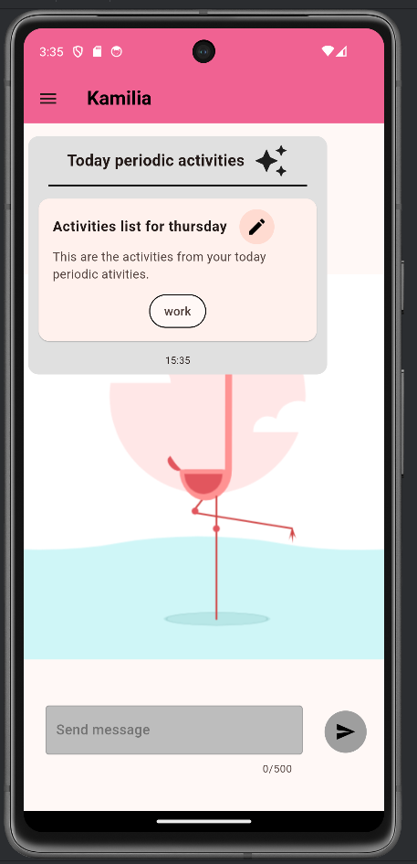
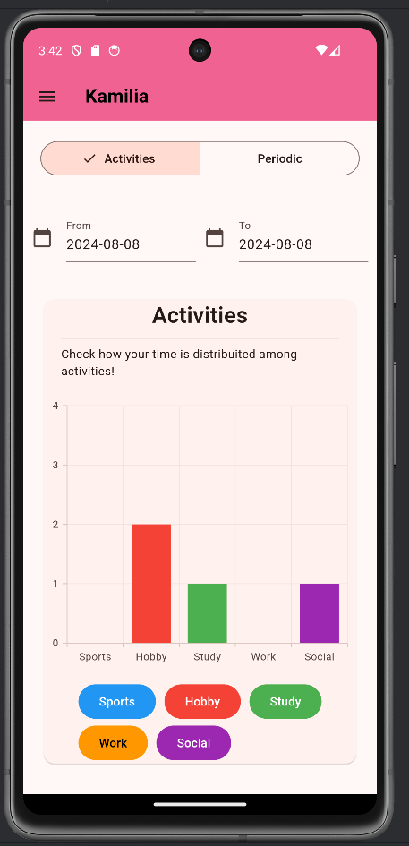
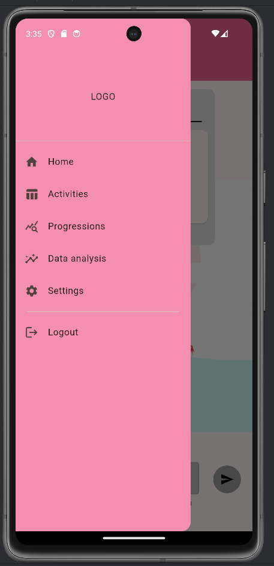

# Khamilia

It's a chat based application in which you provide a description of your day, given this description Geminy AI will extract information as the activities performed during that day and the emotions/moods that the used inserted. The user can ask queries to the chat asking for a range of dates of specific days to check it's data (this data can also be seen in a dedicated page). The app can help users to understand better how they live their life for example for people who follow a psychotherapy path this might help discover some data, so it has can be also used in a medical field. There is also an experimental function in which the users can track their sports activities always using the chat provided in the app. So Gemini AI is used basically in 2 ways extract info from what is written in the chat for example it will extract activities, emotions or the sports based, it can detect if the user is asking for help and if it't performing a query. Another way it's used is to display the data to the users especially the data of activities and emotions which will be grouped together for the activities in 5 groups: hobby, sports, social,work,learning. For emotions it will provide a description of the list of emotion.

## screenshots of the application looks alike

In the homepage which is the chat of the application to interact with the AI it is possible to type how your day was like. The first message that will be received in the app is the one relative to the periodic activities (the one executed every days)

In the activities page it is possible to check how we spend our time, set the periodic activities and check also the emotions.

From the menu it is possible to see that there is a progression page, in which the progression will be exposed and a data anlysis page in which it will be possible to check if some activities have correlations with our emotions

## App exectuion

You can execute the app running the flutter command to start the application

